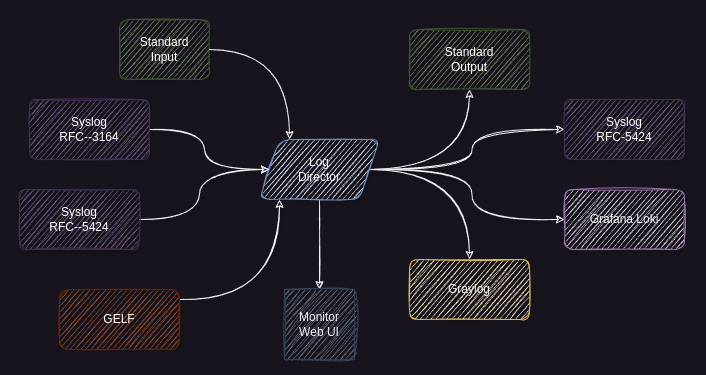

# Syslog Director

All received messages are written to *stdout* and/or forwarded to one or more remote logging destinations.

Supported incoming message formats are:
- Syslog RFC5424 - TCP and UDP
- Syslog RFC3164 (BSD) - TCP and UDP
- Graylog GELF - TCP and UDP (compressed & chunked)

Supported remote logging destinations are:
- Syslog (RFC5424 over UDP)
- Graylog (GELF over UDP)
- Grafana Loki (HTTP over TCP).

This software is free to use and is licensed under the [Apache 2.0 License](LICENSE).



Some of my other related projects are:

- [hmci](https://github.com/mnellemann/hmci) for agent-less monitoring of IBM Power servers
- [svci](https://github.com/mnellemann/svci) for monitoring IBM Storage (Flashsystems / Storwize / SVC)
- [sysmon](https://github.com/mnellemann/sysmon) for monitoring directly from host with a small Java agent

## Usage Instructions

- Install the syslogd package (*.deb* or *.rpm*) from [releases](https://github.com/mnellemann/syslogd/releases) or build from source.

```text
Usage: syslogd [-dhV] [--[no-]ansi] [--[no-]stdin] [--[no-]stdout] [--[no-]tcp]
               [--[no-]udp] [-f=<protocol>] [-p=<num>] [--to-gelf=<uri>]
               [--to-loki=<url>] [--to-syslog=<uri>]
  -d, --debug               Enable debugging [default: 'false'].
  -f, --format=<protocol>   Input format: RFC-5424, RFC-3164 or GELF [default:
                              RFC-3164].
  -h, --help                Show this help message and exit.
      --[no-]ansi           Output in ANSI colors [default: true].
      --[no-]stdin          Forward messages from stdin [default: true].
      --[no-]stdout         Output messages to stdout [default: true].
      --[no-]tcp            Listen on TCP [default: true].
      --[no-]udp            Listen on UDP [default: true].
  -p, --port=<num>          Listening port [default: 1514].
      --to-gelf=<uri>       Forward to Graylog <udp://host:port>.
      --to-loki=<url>       Forward to Grafana Loki <http://host:port>.
      --to-syslog=<uri>     Forward to Syslog <udp://host:port> (RFC-5424).
  -V, --version             Print version information and exit.
```

The default syslog port (514) requires you to run syslogd as root / administrator.
Any port number above 1024 does not require privileges and can be selected with the *-p* or *--port* option.

------

<details closed>
  <summary><B>Examples</B></summary>

Listening on a non-standard syslog port:

```shell
java -jar /path/to/syslogd-x.y.z-all.jar --port 1514
```

or, if installed as a *deb* or *rpm* package:

```shell
/opt/syslogd/bin/syslogd --port 1514
```

Forwarding messages on to another log-system on a non-standard port.

```shell
/opt/syslogd/bin/syslogd --to-syslog udp://remotehost:1514
```

Forwarding messages to a Graylog server in GELF format.

```shell
/opt/syslogd/bin/syslogd --to-gelf udp://remotehost:12201
```

Forwarding to a Grafana Loki server.

```shell
/opt/syslogd/bin/syslogd --to-loki http://remotehost:3100
```

Started from a tmux session, listening for syslog messages and forwarding to a remote Graylog server:

```shell
tmux new-session -d -s "syslogd" "/opt/syslogd/bin/syslogd -p 514 --to-gelf=udp://remotehost:12201"
```

If you don't want any output locally (only forwarding), you can use the ```--no-stdout``` flag.

</details>

------

<details closed>
  <summary><B>Notes</B></summary>

### IBM AIX and VIO Servers

Syslog messages from AIX (and IBM Power Virtual I/O Servers) can be troublesome with some logging solutions. These can be received with
*syslogd* and then forwarded on to your preferred logging solution.

### Forwarding to Grafana Loki

Forwarding is currently done by making HTTP connections to the Loki API, which works fine for low volume messages, but might cause issues for large volume of messages.

</details>


------

<details closed>
  <summary><B>Development</B></summary>

### Test Grafana Loki

Run Loki and Grafana in local containers to test.

```shell
docker run --rm -d --name=loki -p 3100:3100 grafana/loki
docker run --rm -d --name=grafana --link loki:loki -p 3000:3000 grafana/grafana:7.1.3
```

</details>
